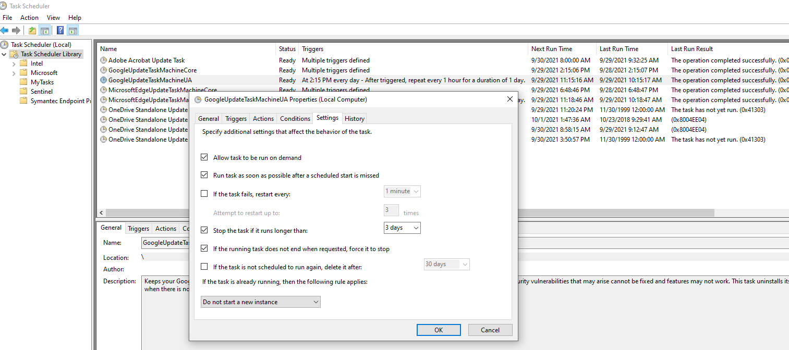

## Introduction
The windows specific commands are given in this section

## Running Applications

### Scheduled Tasks

- Windows scheduled task deployment can be automated using XML files via CI-CD pipelines
- When a task stops due to "Stop the task if it runs longer than:", a system level message will be "^C" (Simulating an end task ^C) in windows 10. 

