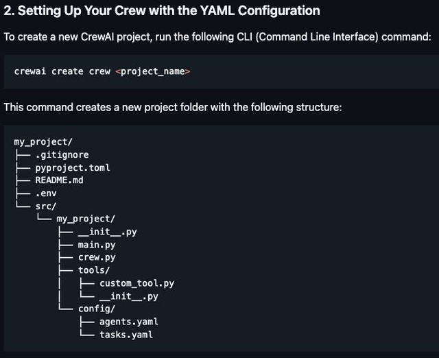

[Reference 1](https://github.com/sigoden/aichat/blob/main/config.agent.example.yaml)

# Agent-specific configuration
# Location `<aichat-config-dir>/agents/<agent-name>/config.yaml`

model: openai:gpt-4o             # Specify the LLM to use
temperature: null                # Set default temperature parameter, range (0, 1)
top_p: null                      # Set default top-p parameter, with a range of (0, 1) or (0, 2) depending on the model
use_tools: null                  # Which additional tools to use by agent. (e.g. 'fs,web_search')
agent_prelude: null              # Set a session to use when starting the agent. (e.g. temp, default)
instructions: null               # Override the instructions for the agent, have no effect for dynamic instructions
variables:                       # Custom default values for the agent variables
  <key>: <value>

[Reference 2](https://www.restack.io/p/agent-architecture-answer-yaml-for-ai-agent-design-cat-ai)

agents:
  - name: Agent1
    tasks:
      - task_id: 1
        description: "Perform data analysis"
  - name: Agent2
    tasks:
      - task_id: 2
        description: "Generate report"

agents:
  - name: DataCollector
    role: "Collects data from various sources"
    tasks:
      - task_id: 1
        description: "Fetch data from API"
        parameters:
          endpoint: "https://api.example.com/data"
          method: "GET"
  - name: DataAnalyzer
    role: "Analyzes collected data"
    tasks:
      - task_id: 2
        description: "Run statistical analysis"
        parameters:
          analysis_type: "regression"
  - name: ReportGenerator
    role: "Generates reports based on analysis"
    tasks:
      - task_id: 3
        description: "Create summary report"
        parameters:
          format: "PDF"

agent:
  name: MyAI
  type: conversational
  features:
    - natural_language_processing
    - multi_agent_collaboration
  configuration:
    settings:
      timeout: 30
      retries: 5
    custom_settings:
      logging_level: debug
      max_connections: 10

[Reference 3](https://www.threads.net/@matt_dancho/post/DDKcmHUNQLf)

[Reference 4](https://github.com/Codium-ai/codium-code-examples/blob/main/.github/workflows/pr-agent.yaml)

# This workflow enables developers to call PR-Agents `/[actions]` in PR's comments and upon PR creation.
# Learn more at https://www.codium.ai/pr-agent/
# This is v0.2 of this workflow file

name: PR-Agent

on:
  workflow_dispatch:
  pull_request:
  issue_comment:
  pull_request_review_comment:

permissions:
  issues: write
  pull-requests: write

jobs:
  pr_agent_job:
    runs-on: ubuntu-latest
    name: Run pr agent on every pull request
    steps:
      - name: PR Agent action step
        id: pragent
        uses: Codium-ai/pr-agent@main
        env:
          OPENAI_KEY: ${{ secrets.OPENAI_KEY }}
          OPENAI_ORG: ${{ secrets.OPENAI_ORG }} # optional
          GITHUB_TOKEN: ${{ secrets.GITHUB_TOKEN }}
          GITHUB_ACTION.AUTO_DESCRIBE: true
          GITHUB_ACTION.AUTO_REVIEW: true
          GITHUB_ACTION.AUTO_IMPROVE: true
          PR_CODE_SUGGESTIONS.SUMMARIZE: true