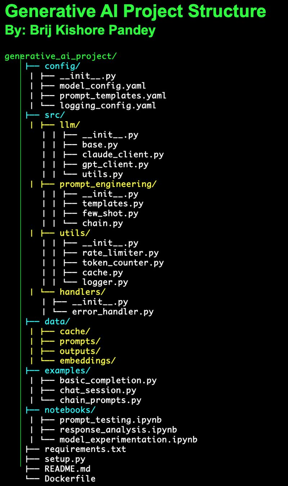

As AI continues to evolve, having a well-organized project structure is crucial. Here's a production-ready template I've developed for working with LLMs like Claude and GPT:

Key components:

?? src/llm: Core integration with various LLM models
?? src/prompt_engineering: Template management and chain handling
?? data/: Organized storage for prompts, cache, and outputs
?? notebooks/: For experimentation and analysis
?? examples/: Ready-to-use implementation samples

What makes this structure unique:
- Clean separation of concerns
- Scalable architecture
- Easy model switching
- Efficient prompt management
- Built-in utilities for rate limiting and token counting

Perfect for teams building:
- AI-powered applications
- Chat interfaces
- Content generation systems
- Language model experimentation

