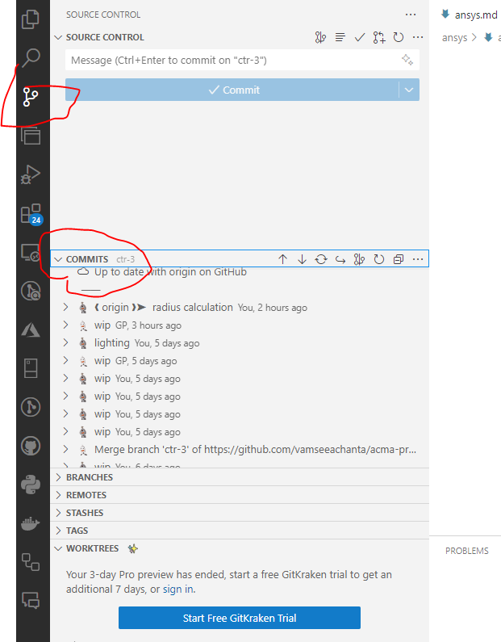
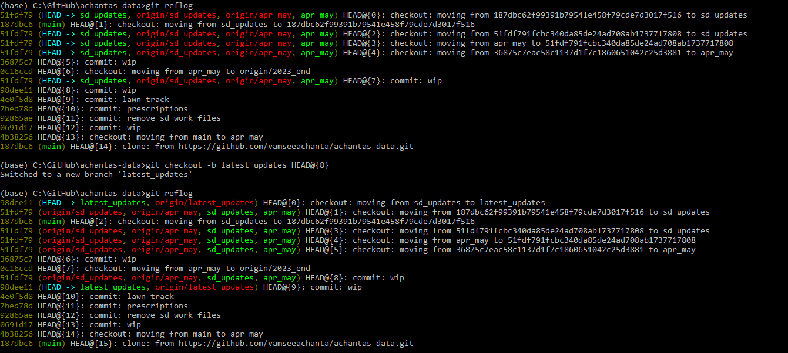

## Introduction

Git is a Verson control tool

## VS code - Checking commits

Other history using flog

### References

<https://stackoverflow.com/questions/4786972/get-a-list-of-all-git-commits-including-the-lost-ones>
