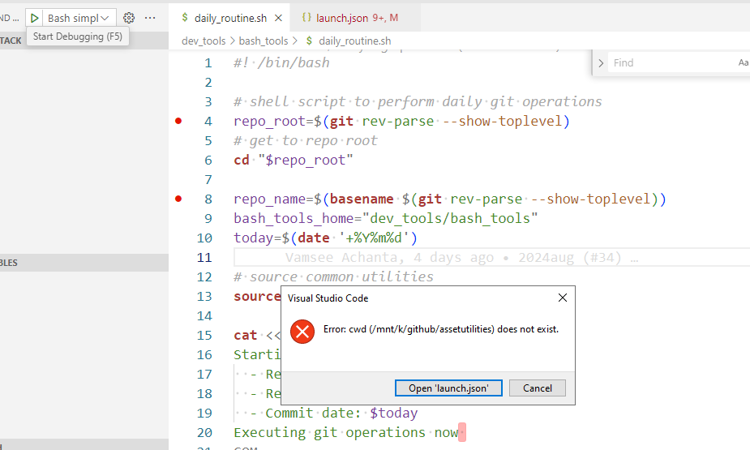

# Common commands

https://stackoverflow.com/questions/69064682/javascript-debug-terminal-keeps-opening-using-powershell-instead-of-git-bash

"terminal.integrated.profiles.windows": {
    "GitBash": {
      "path": ["C:\\Program Files\\Git\\bin\\bash.exe"],
      "source": "Git Bash",
      "icon": "terminal-bash"
    },
},
"terminal.integrated.defaultProfile.windows": "Git Bash",

Run and debug bash script from VSCode
https://askubuntu.com/questions/1228213/how-to-run-and-debug-bash-script-from-vscode

### VS Code Extension

**WSL - Windows Subsystem for Linux**
https://marketplace.visualstudio.com/items?itemName=rogalmic.bash-debug

Using the extension, encoutered error in windows as below:

### exit codes

0: Success
1: General errors
2: Misuse of shell builtins (according to Bash documentation)
126: Command invoked cannot execute

https://askubuntu.com/questions/892604/what-is-the-meaning-of-exit-0-exit-1-and-exit-2-in-a-bash-script

