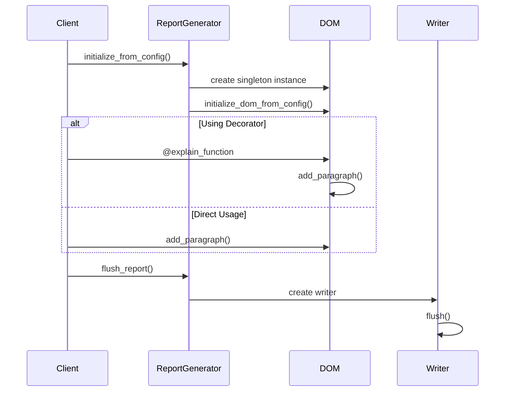
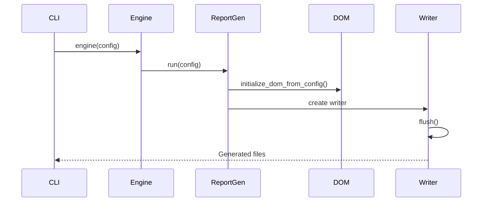

# ReportGen Module Documentation

## Core Module Files

1. **dom.py**
   - Purpose: Implements Document Object Model for report structure
   - Key Patterns: Singleton pattern with thread safety
   - Classes:
     - `Section`: Represents document sections with paragraphs
     - `DocumentDOM`: Main DOM implementation with singleton pattern
   - Usage: Central data structure for report content
   - Inputs: Configuration dictionary, text content, sympy expressions
   - Outputs: Structured document representation

2. **reportgen.py**
   - Purpose: Main report generation orchestrator
   - Key Patterns: Factory pattern for writer selection
   - Classes:
     - `ReportFormat`: Enum for supported formats
     - `ReportGenerator`: Main generator class
   - Usage: Entry point for report generation
   - Inputs: Configuration dictionary
   - Outputs: Generated reports in markdown/docx formats

3. **writers.py**
   - Purpose: Writer implementations for different output formats
   - Key Patterns: Registry pattern, Template method pattern
   - Classes:
     - `ReportWriterRegistry`: Writer registration
     - `ReportWriter`: Abstract base class
     - `DefaultMDWriter`: Markdown writer
     - `DefaultDOCXWriter`: Word document writer
   - Usage: Converts DOM to specific output formats
   - Inputs: DocumentDOM instance
   - Outputs: Markdown/Word files

4. **decorator.py**
   - Purpose: Function documentation decorator
   - Key Patterns: Decorator pattern
   - Functions: `explain_function` decorator
   - Usage: Automatically documents function execution
   - Inputs: Function metadata, arguments
   - Outputs: Formatted documentation in report

## Configuration File

### Base Configuration
Located at: `/src/assetutilities/base_configs/modules/reportgen/reportgen.yml`

### override configuration 

sample located at ``/tests/modules/reportgen/reportgen-cfg-20in-md.yml``

# How to Invoke
1. Client Implementation (sympy_function_1.py)

```
from assetutilities.common.reportgen.reportgen import ReportGenerator
from assetutilities.common.reportgen.decorator import explain_function

# Initialize generator
generator = ReportGenerator()
generator.initialize_from_config(config)

# Use decorator for automatic documentation
@explain_function(purpose="Calculate something")
def my_function():
    # function code
    pass

# Add content directly
generator.dom.add_paragraph("Some content")
generator.flush_report()
```

2. Module Implementation

``python -m assetutilities config.yml``

# Implementation Flow

## Client Implementation Flow
1. Client creates ReportGenerator instance
2. Initializes from config
3. Adds content via:
   1. Decorator on functions
   2. Direct DOM manipulation
4. Calls flush_report() to generate output
5. Writer handles output generation

## Module Implementation Flow
1. Engine loads config
2. Creates ReportGenerator
3. Configures DOM from config
4. Creates appropriate writer
5. Generates output files

# Sequence Diagrams
Client Implementation Flow





## Key Features
- Thread-safe singleton DOM
- Pluggable writer implementations
- Function documentation decorator
- Support for markdown tables
- Support for SymPy expressions
- Configurable section structure
- Multiple output formats (MD, DOCX)